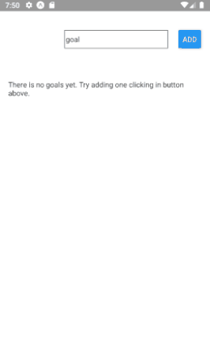

#React Native First App

Well, I've basically decided to enter the world of mobile development and for that I choose React-Native because of the my contact with React.
The idea of this app is very simple. You type the goal and tap the add button to add the item to the list of goals. When you tap the list item, it gets the index of the tapped item and delete it from the list. Simple as that.
Things that I've learned from this project
  - Import pre-build components from 'react-native'
  - The native button is just very simple and doesn't have the style props, which makes me find the alternative component below
  - TouchableOpacity is very useful and I used to capture the onPress event when the View is clicked. It can be a very customizable button as well
  - You have to explicity define when a View is Scrollable, using ScrolView or FlatLists (I miss you scroll: auto)
  - ScrollViews renders all the items in the list, which is not very suitable for rendering large lists
  - FlatLists renders only the items that are showing in the view in that moment which makes this component in general faster than ScrollViews.
  - The default behaviour of flex-direction in React-Native is column, which is the opposite of CSS's behaviour.
  
 
  
